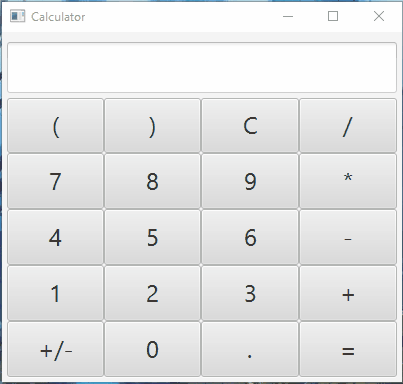

# Java Calculator

A simple calculator that can perform addition, subtraction, multiplication, 
and division. Uses Java for functionality and JavaFX for the UI.

Implementing a way to parse the text field into an equation was the most difficult. 
It uses a simple grammar to accomplish that. I was able to find an algorithm on 
[StackOverflow](https://stackoverflow.com/questions/3422673/how-to-evaluate-a-math-expression-given-in-string-form) 
which I modified for my needs.

Future implementations will include more functions such as parenthesis, 
unary operators, and functions.

## Install

You can download Java [here](https://www.java.com/)

You can download JavaFX [here](https://gluonhq.com/products/javafx/)

Since JavaFX is no longer included in Java follow the directions below to get it set up

[Getting Started with JavaFX](https://openjfx.io/openjfx-docs/)

## Demo

